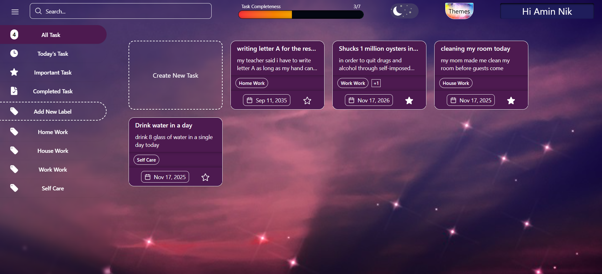

# Todo List — Full-Stack Project

###  A simple full-stack Todo List app built with Next.js and TypeScript

## **[Click to See Live Demo](https://todo-list-amin-niks-projects.vercel.app/)**

### Technologies and Features:

- ### [![Next][Next.js]][Next-url] and [![typescript][typescript]][typescript-url] for building the app.
- ### [![tailwind][tailwind]][tailwind-url] and [![shadcn][shadcnui]][shadcnui-url] to handle multiple themes and styling.
- ### [![react hook form][reacthookform]][reacthookform-url] and [![zod][zod]][zod-url] for form handling and validation.
- ### [![mongodb][mongodb]][mongodb-url] as the database and [![prisma][prisma]][prisma-url] as the ORM.
- ### Cookies and [![jsonwebtokens][jsonwebtokens]][jsonwebtokens-url] for user authentication (session management).
- ### Next.js Server Actions for server-side requests.

## Environment Variables:

### To run this project, you will need to add the following environment variables to your .env file

`DATABASE_URL`

`SESSION_SECRET`

[Next.js]: https://img.shields.io/badge/Next.js-000000?&logo=nextdotjs&logoColor=white
[Next-url]: https://nextjs.org/
[typescript]: https://img.shields.io/badge/TypeScript-3178C6?&logo=typescript&logoColor=white
[typescript-url]: https://www.typescriptlang.org/
[tailwind]: https://img.shields.io/badge/Tailwind_CSS-06B6D4?&logo=tailwindcss&logoColor=white
[tailwind-url]: https://tailwindcss.com/
[shadcnui]: https://img.shields.io/badge/shadcn_ui-000000?&logo=shadcnui&logoColor=white
[shadcnui-url]: https://ui.shadcn.com/
[reacthookform]: https://img.shields.io/badge/React_Hook_Form-EC5990?&logo=reacthookform&logoColor=white
[reacthookform-url]: https://react-hook-form.com/
[zod]: https://img.shields.io/badge/Zod-408AFF?&logo=zod&logoColor=white
[zod-url]: https://zod.dev/
[mongodb]: https://img.shields.io/badge/MongoDB-47A248?&logo=mongodb&logoColor=white
[mongodb-url]: https://www.mongodb.com/
[prisma]: https://img.shields.io/badge/Prisma-2D3748?&logo=prisma&logoColor=white
[prisma-url]: https://www.prisma.io/
[jsonwebtokens]: https://img.shields.io/badge/JWT-000000?&logo=jsonwebtokens&logoColor=white
[jsonwebtokens-url]: https://www.jwt.io/
